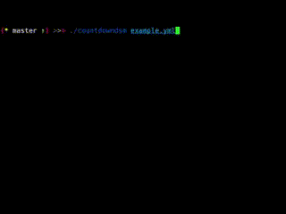

# Countdown DSM

<p align="center">
  <br>
  
  <br>
</p>

## Concept

A timer for the performance of a certain list of speakers, strictly regulated by time.

Each participant goes through all the set stages of the performance. If the speaker has managed earlier, you can press
`Space` or `Enter` and go to the next stage. If the speaker did not make it in time, it means he was late.

## Install

Download the binary file from [releases](https://github.com/Piknik1990/countdowndsm/releases).

## Usage

The application is configured via a yaml file, the path to which is passed as an argument

```sh
countdowndsm /path/to/config.yml
```

The configuration file contains the following parameters:

* `persons` - a list of the names of the speakers. Each of them will go through the stages of performing from `acts`
* `random` - the flag for mixing persons. If `false` - the speakers will be in random order; `true` - strictly according to the list
* `acts` - the order of the stages of performances for each of the persons above:
  * `name` - the name of the stage
  * `time` - time of the stage
* `counter` - add a person counter
* `next` - show the next person

## Key binding

* `Space` or `Enter`: Skip the current stage
* `Esc` or `Ctrl+C`: Stop the program
* `Tab`: Pausing the timer

## License

[MIT](LICENSE)
